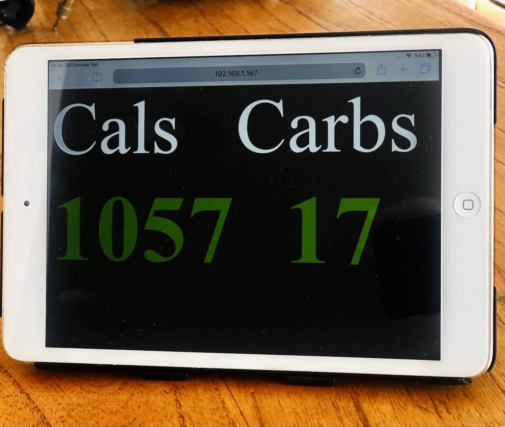

# Cronometer Reporter

<!-- [![Stargazers][stars-shield]][stars-url] -->
[![Issues][issues-shield]][issues-url]
[![MIT License][license-shield]][license-url]

<!-- PROJECT LOGO -->
<br />
<p align="center">
  <h2 align="center">Cronometer Reporter</h2>

  <p align="center">
    Report your calories and carbs from <a href="https://cronometer.com/">cronometer</a>.
    <br />
  </p>
</p>

## About The Project

Since cronometer won't release an API, I built this. This starts an express server and gives you two endpoints to display your current calorie and net carb information. The homepage `/` is meant to display this information on some type of screen: second monitor, iPad, etc. The page automatically refreshes at an interval.

Note:

_The page displays different color lines across the screen at an interval in order to prevent screen burn in. I hope this enough. I accept no responsibility for broken screens._

<center></center>

The second endpoint `/json` is to consume the data and do as you wish. Personal, I use the JSON endpoint for displaying my calorie and carb information in my macOS menu bar.

![macOS Menu][mac-menu]

You can run the server locally on your computer, on a computer on your network, on some server, or using a service such as [glitch](https://glitch.com). In theory, if you run this on glitch, the server shouldn't sleep, but I haven't tested this.

### Prerequisites

As stated above, you need a computer to run this on.

You have to have [node](https://nodejs.org/en/download) and npm installed. I recommend using doing so via [nvm](https://heynode.com/tutorial/install-nodejs-locally-nvm).

Obviously an account and data on cronometer.

## Installation

1. Clone the repo
2. Install NPM packages
```sh
npm install
```

## Usage

```sh
USERNAME="username_here" PASSWORD="your_password_here" npm run start
```

Or

```
USERNAME="username_here" PASSWORD="your_password_here" node index.js
```

_Alternatively, you can hardcode your username and password in the [index.js file](./index.js#L11)._

## Other params

To show more info in the terminal use the `DEBUG` param.

```sh
DEBUG=true USERNAME="username_here" PASSWORD="your_password_here" npm run start
```

To use a different port use the `PORT` param.

```sh
PORT=1337 USERNAME="username_here" PASSWORD="your_password_here" npm run start
```

To spawn the browser window and see the scrapping in action, or to do some debugging use the `HEADLESS` param.

```sh
HEADLESS=false USERNAME="username_here" PASSWORD="your_password_here" npm run start
```

### Optional Webhook

**I recommend using this with the webhook option.**

I use this [tampermonkey](https://www.tampermonkey.net/) [script](https://gist.github.com/stevenirby/cbb26cb1571915952f1ccad99f058cd9) I created, which scrapes the same data in real time and sends it to the server via a webhook. All while you log your food on your computer.

Here's why:
* This updates the server faster after you log food.
* It's nicer not to hit their server and scrape the data one less time.

For a simple webhook, I use the free service [patchbay](https://patchbay.pub/).

```sh
USERNAME=username_here PASSWORD='password_here' WEBHOOKURL='https://patchbay.pub/<unique_id_here>?persist=true' npm run start
```

## Contributing

Pull requests or suggestions are welcome!


## License
[MIT](https://choosealicense.com/licenses/mit/)


[stars-shield]: https://img.shields.io/github/stars/stevenirby/cronometer-reporter.svg?style=flat-square
[stars-url]: https://github.com/stevenirby/cronometer-reporter/stargazers
[issues-shield]: https://img.shields.io/github/issues/stevenirby/cronometer-reporter.svg?style=flat-square
[issues-url]: https://github.com/stevenirby/cronometer-reporter/issues
[license-shield]: https://img.shields.io/github/license/stevenirby/cronometer-reporter.svg?style=flat-square
[license-url]: https://github.com/stevenirby/cronometer-reporter/blob/master/LICENSE.txt
[mac-menu]: public/mac_menu.png
[iPad]: public/ipad.jpg
